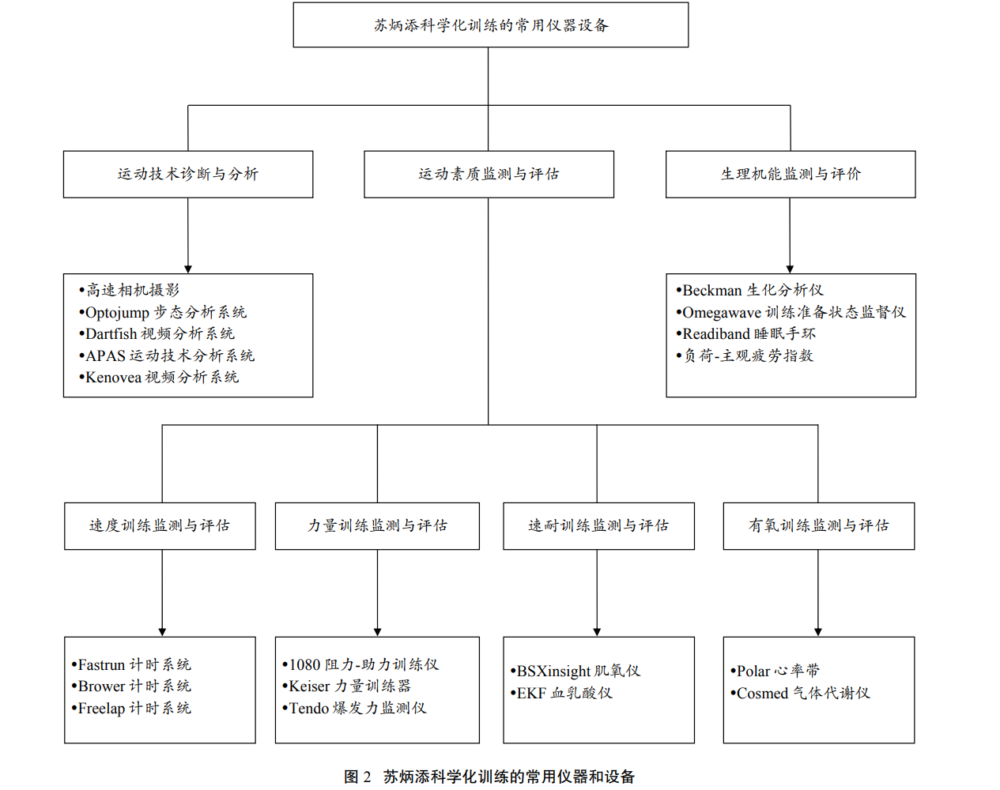

八月划水

<!-- more -->

[TOC]

## 短跑100米

苏炳添半决赛9.83秒破亚洲纪录，32岁老将，放在里约奥运会和博尔特同台竞技也是银牌水准，在我眼里其历史地位接近刘翔。于是好奇查了查这个人的相关资料，竟发现他还发表了不少论文和励志小故事，读了一些他发表的文章，感觉有趣，遂记录。

### 一篇论文

苏炳添在2019年发表的一篇关于100米短跑论文，本篇论文非常有趣，一些观点也很有启发意义。

> 新时代中国男子 100m 短跑：回顾与展望

```bibtex
@article{苏炳添2019新时代中国男子,
  title={新时代中国男子 100m 短跑: 回顾与展望},
  author={苏炳添 and 邓民威 and 徐泽 and 梁伟 and 姜自立 and 王国杰},
  journal={体育科学},
  volume={39},
  number={2},
  pages={22--28},
  year={2019}
}
```

1. 新时代

  这个词可以说很中国特色了，全文累计出现32次，在第五部分中国男子100m短跑短跑发展对中国竞技体育的启示中出现的尤其多。

2. 以笔者为例

  是不是体育类论文就可以这么干？前段时间帮老板找了找关于掷铁饼的论文，里面也是以个别优秀运动员为例进行分析

3. 科学训练的作用

  > 所谓科学化训练理念，是指符合专项竞技能力发展规律、人体生理机能状态变化规律和运动员个人特点的训练理念。美国是世界公认的科学化训练程度最高的国家，笔者的现任教练 Randy Huntington，谢震业和韦永丽的现任教练 Rana Reider 均 是 来 自 美 国 的 著 名 教 练 员 。 Randy Huntington 和 Rana Reider 都是典型的“科研型教练”，他俩的整体训练思路是：以“冠军模型”为指导，通过高科技仪器和设备对运动员体能、技术、恢复等各个环节进行全方位监控，据此发现问题，寻找差距，制订个性化的训练方案，进而恶补短板，全面提升运动员的竞技能力。

  看看用到的设备和监测指标

  

  一般人也玩不起哈哈哈，另外从训练的作用来看，和高水平研究机构的合作非常重要，在突破自我和人类极限上，甚至起决定性作用。舆论有些民族主义（外宣内宣化）的情况下，还是要认识到别人能牛b的根本因素是什么。

4. 评价

  总结6点中国团体100米跑成功经验，给出4条未来发展方略，有定量分析，也有一些事例分析，但是事例分析更多是以见闻这种形式阐述，一般论文这么写可能需要加一些数据，但毕竟作者是跑神哈哈哈。

### 一篇小故事

经典鸡汤，没想到苏神不仅能跑步，写论文，还能煨鸡汤。

```bibtex
# 中华儿女
@article{苏炳添2018演绎,
  title={演绎 “中国速度”},
  author={苏炳添},
  journal={中华儿女},
  number={4},
  pages={4--4},
  year={2018}
}

# 意林
@article{苏炳添2019我必须追上去,
  title={我必须追上去},
  author={苏炳添},
  journal={意林 (原创版)},
  year={2019}
}
```

1. 两篇文章是一样的

  可能意林抄中华儿女的，还是苏神一稿多投（bushi）？毕竟中华儿女是共青团中央主管，总设计师还提过词，而意林是长春市委宣传部主管。

2. 跑神竟也是鸡汤大师

  > 现在，我的竞争对象变成了自己。我的下一个目标，就是要突破9.90秒的成绩。这是一个大关，就像破 10 秒一样。我希望自己能够成为国内第一个突破 9.90秒的运动员。短跑一直被认为是挑战速度的极限。对于我来说，人不应该给自己设限，而要看看能不能逼自己做出新的成绩。突破自我极限的方法很简单，就是好好训练。

  > 当你在特别累、特别无聊、特别枯燥的时候，想一想自己的目标，你就不累了。我的目标就是跑得更快。

  一闻就是鸡汤的味道哈哈哈，还是论文读的舒服，老老实实讲了讲自己怎么样好好训练，怎么样能跑的快。或者是鸡汤文篇幅受限，不能讲如何训练？
